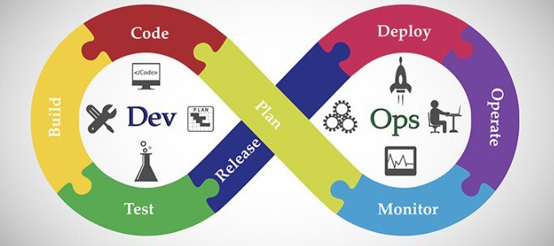

  
  <h1>Hi!My name is Alex Eze.</h1>
  
 
  
  <!-- -->
  

 
 <!-- 
 -->

  

    <h1>Skills | Knowlege Base</h1>
    
  

  

    <h3>Languages</h3>
    
    
    
    
  

    <h3>Backend</h3>

    
    
    

    
    
    
  

<h3>Cloud Service</h3>
    
    
     
   

   
  

  

    <h3>Version Control System & CI/CD</h3>
      
   
     
    
    
  

  

    <h3>IDEs, Tools & Platform</h3>
    
      
     
    
                                                                                                                      
  

  

    <h3>Frontend</h3>
    
    
    
    
  

  
  

    <h3>Database</h3>
    
    
  

  
&nbsp;

  
  

  <samp>
   
- 👯 Looking out to collaborate on <strong>Cloud and end-to-end Automation Infrastructure</strong> ☁

- 🤝 I’m looking for help with **AI, LLM and ML** 🦾

- 👨‍💻 All of my projects are available at [Github](https://github.com/iAlexeze?tab=repositories)

- 💬 Ask me about **Tech, Health, & Fitness**

- 🧡 Interested in **Science, Business and Politics** in that order 😀

- ⚡ Daily fact: **You don't get a SECOND CHANCE to make a FIRST IMPRESSION**

&nbsp;

    
  </samp>

  <h3>Let's Connect😀</h3>
  

     
    
    
  

  

    
                                                                                                                            
  

  

    <h3>Message Me📩</h3>
    
     
     
 

  
                                                                                                                           
     
                                                                                                                                    

&nbsp;

  

                                                                                                                                   

  <h2>Github stats</h2> 
  
  

  

